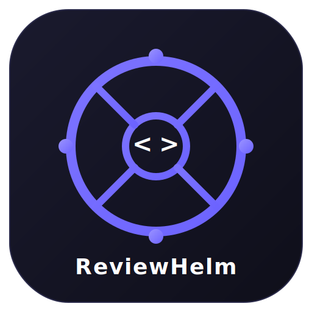
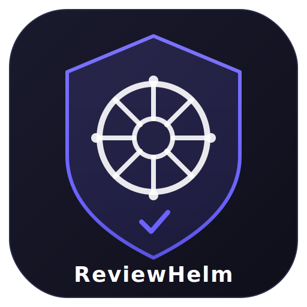
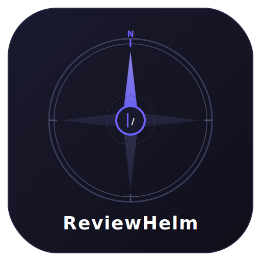
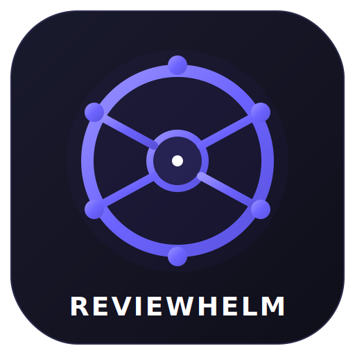
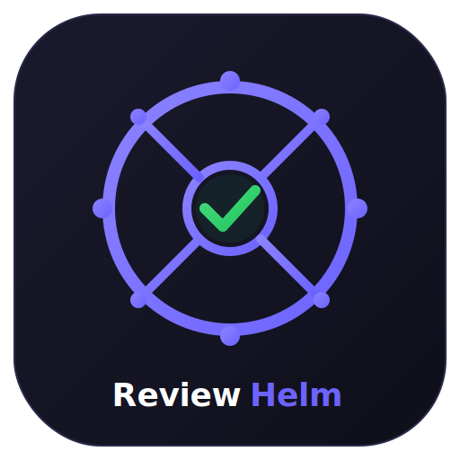

ch # ReviewHelm Logo Exploration

## Concept 1 — Helm + Code Brackets
Ship's wheel with `< >` code brackets in the center. 8 spokes, handle knobs on cardinal points. Purple gradient on dark background.

**Strengths:** Directly combines both words of the name. Code brackets immediately signal "developer tool."
**Best for:** Developers who want an unmistakably code-focused identity.

---

## Concept 2 — Shield + Helm
Purple shield outline containing a white helm wheel. Small checkmark at the shield's base.

**Strengths:** Shield conveys quality gatekeeping/protection. Elegant, professional feel. The checkmark adds a "verified" touch.
**Best for:** Emphasizing the quality assurance / code guardian aspect of reviews.

---

## Concept 3 — Compass + Code
Compass rose with purple north pointer, blinking code cursor in the center. Tick marks and "N" marker.

**Strengths:** Strong learning/navigation metaphor. The compass says "I'll guide you." Animated cursor adds life.
**Best for:** Emphasizing the learning journey — becoming a better reviewer over time.

---

## Concept 4 — Minimal Wheel
Clean 6-spoke helm wheel. Bold purple gradient with subtle glow. Center dot. All-caps "REVIEWHELM" wordmark.

**Strengths:** Most scalable — reads clearly at any size (app icon, notification badge, favicon). Clean and modern. 6 spokes instead of 8 keeps it uncluttered.
**Best for:** App icon primary use case. Best small-size readability.

---

## Concept 5 — Helm + Green Checkmark
8-spoke purple wheel with a green checkmark in the center (PR approved). Split-color wordmark: "Review" in white, "Helm" in purple.

**Strengths:** Green checkmark = PR approved. Two-color accent gives energy and personality. The split wordmark reinforces the two-part name.
**Best for:** Conveying the satisfaction of a thorough review. Most visually distinctive of the five.

---

## Comparison Notes

| Concept | Icon Scalability | Code Identity | Learning Feel | Distinctiveness |
|---------|:---:|:---:|:---:|:---:|
| 1. Helm + Code | Good | Strong | Medium | Medium |
| 2. Shield + Helm | Good | Low | Low | High |
| 3. Compass + Code | Medium | Medium | Strong | High |
| 4. Minimal Wheel | Best | None | None | Medium |
| 5. Helm + Checkmark | Good | Low | Low | Highest |

## Color Palette
- **Primary Purple:** `#6c63ff`
- **Purple Light:** `#9b93ff`
- **Purple Dark:** `#5a52dd`
- **Background:** `#0f0f1a` → `#1a1a2e`
- **Green Accent (Concept 5):** `#22c55e` → `#4ade80`

## Next Steps
- Pick a direction (or combine elements from multiple)
- Refine the chosen concept
- Create final assets: app icon (adaptive + round), splash screen, in-app header mark
- Export as PNG at required Android sizes (48, 72, 96, 144, 192, 512)
